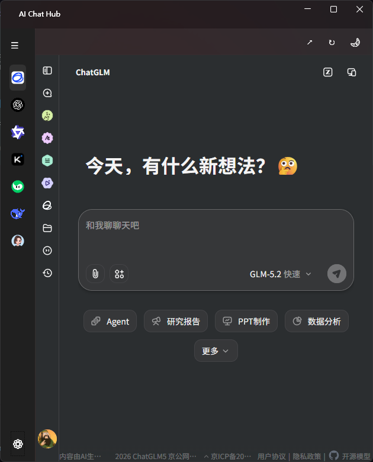
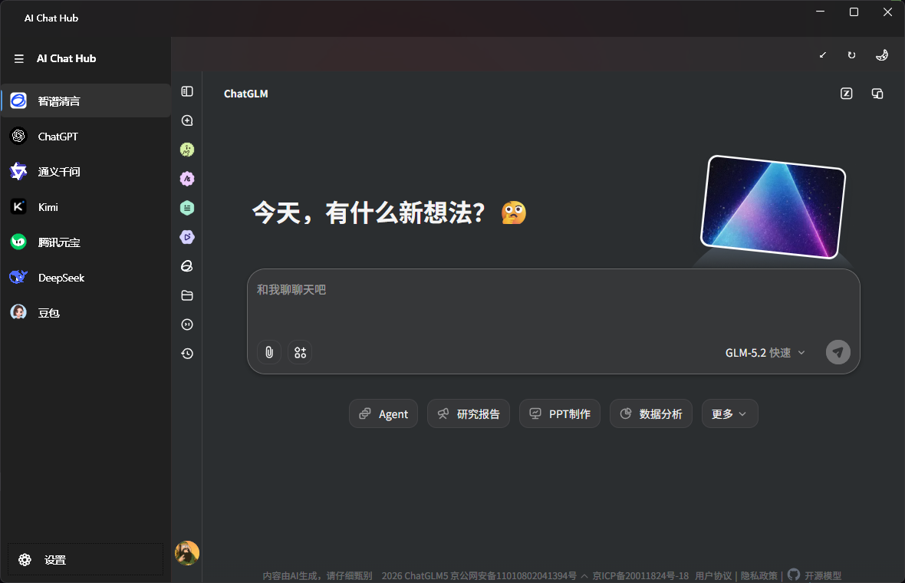
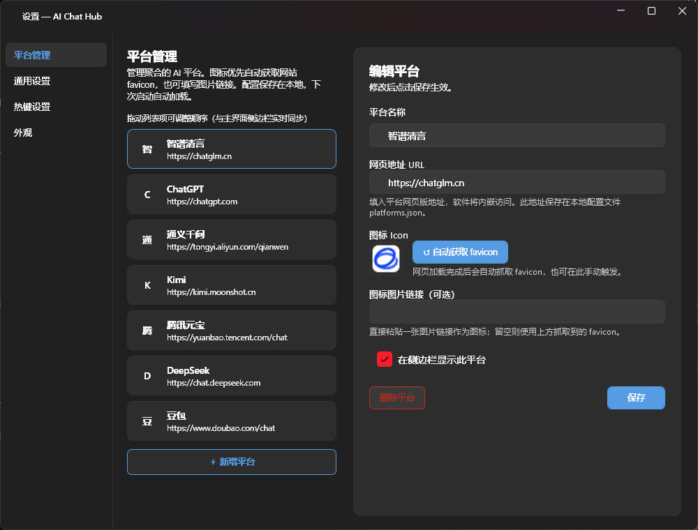
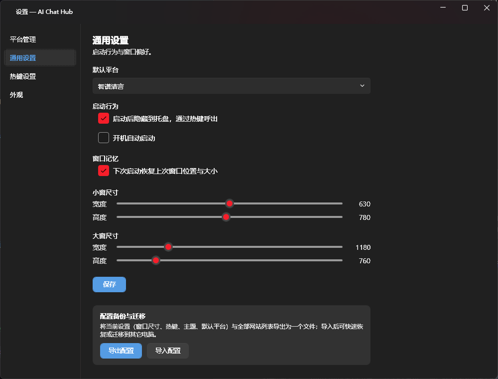
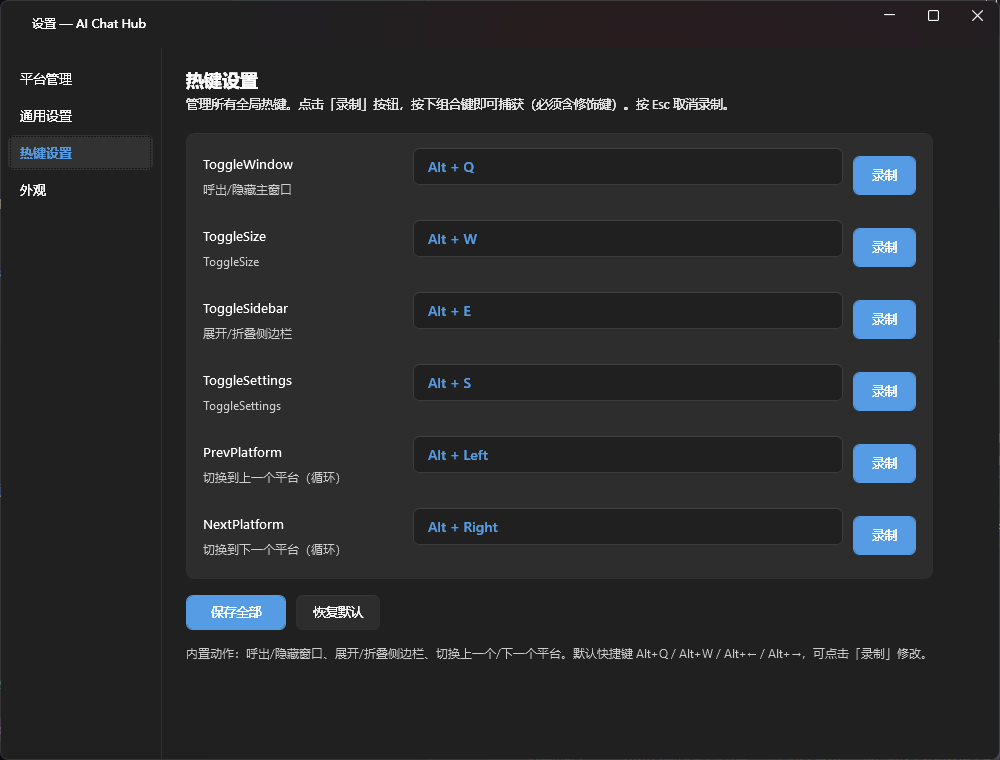
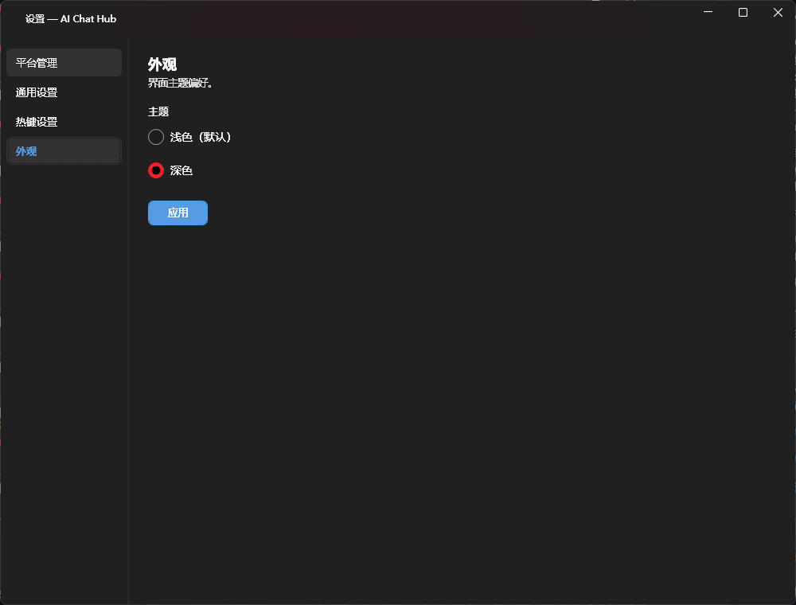
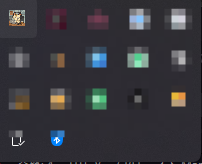

<p align="center">
  
</p>

<h1 align="center">AiMux</h1>

<p align="center">
  <b>一个轻量、可定制、常驻托盘的 AI 多平台聚合桌面客户端</b><br/>
  把 ChatGPT、DeepSeek、通义千问（Qwen）等多种 AI 网站聚合到一个窗口，
  支持多平台切换、小窗/大窗模式、全局快捷键、开机自启与配置导入导出。
</p>

<p align="center">
  
  
  
  
</p>

---

## 📑 目录

- [✨ 项目简介](#-项目简介)
- [🚀 核心功能](#-核心功能)
- [🖼️ 截图](#️-截图)
- [⌨️ 快捷键](#️-快捷键)
- [📦 安装与运行](#-安装与运行)
- [🔧 从源码构建](#-从源码构建)
- [⚙️ 配置说明](#️-配置说明)
- [🧩 技术栈](#-技术栈)
- [🤝 贡献](#-贡献)
- [📄 许可证](#-许可证)

---

## ✨ 项目简介

**AiMux** 是一个基于 WPF（.NET 9）打造的桌面端 AI 聚合工具。它的目标是：

- **一个窗口，多个 AI**：内置多个主流 AI 平台入口，一键切换，无需在浏览器标签页之间反复横跳。
- **像原生应用一样顺手**：支持全局/应用内快捷键、托盘常驻、开机自启、窗口尺寸记忆。
- **高度可定制**：平台列表、窗口尺寸（小屏/大屏）、侧边栏折叠、主题外观、快捷键全部可配置，并支持**配置文件导出/导入**，换电脑一键恢复。

> 本项目为个人开源项目，欢迎 Issue 与 PR。当前版本为首个预览版 `v0.1.0`。

---

## 🚀 核心功能

| 功能 | 说明 |
| --- | --- |
| 🧠 **多平台聚合** | 内置 ChatGPT / DeepSeek / 通义千问（Qwen）等多个平台，左侧列表一键切换 |
| 🪟 **小屏 / 大屏双模式** | 预置两套窗口尺寸（默认小屏 630×780），一键切换，并自动居中 |
| 📌 **托盘常驻** | 关闭主窗口后最小化到系统托盘，**单击托盘图标即唤起主界面** |
| ⌨️ **应用内快捷键** | 窗口切换、尺寸切换、侧栏折叠、设置面板、上下平台切换，全部可自定义 |
| 💾 **配置导入 / 导出** | 一键导出 `.aimux` 配置文件（含平台列表与全部设置），新机器导入即可恢复 |
| 🎨 **外观自定义** | 主色、主题等外观设置，立即生效 |
| 🔁 **开机自启** | 设置中开启后写入注册表，随系统启动 |
| 🖼️ **图标自动获取 / 自定义** | 支持粘贴图标链接即时预览，或自动抓取站点 favicon |
| 📐 **窗口尺寸记忆** | 可记忆上次窗口位置与尺寸（设置中开关） |

---

## 🖼️ 截图

> 📌 截图正在补充中，以下为各界面预览（图片位于 `docs/screenshots/`）。

### 1. 主界面（小屏模式 + 侧边栏）



### 2. 主界面（大屏模式）



### 3. 设置 - 平台管理



### 4. 设置 - 通用 / 快捷键 / 外观 







### 5. 托盘与唤起



---

## ⌨️ 快捷键

> 默认快捷键为「应用内生效」（需主窗口处于打开/聚焦状态），不会与全局程序冲突。
> 可在「设置 → 快捷键」中重新录制。

| 操作 | 默认快捷键 | 说明 |
| --- | --- | --- |
| 唤起 / 隐藏主窗口 | `Alt + Q` | 主窗口可见时隐藏到托盘，隐藏时唤起 |
| 切换 小屏 / 大屏 | `Alt + W` | 切换后窗口自动居中 |
| 折叠 / 展开侧边栏 | `Alt + E` | 在窗口较窄时也会自动折叠 |
| 打开 / 关闭设置 | `Alt + S` | 设置窗口已打开时再次按下可关闭 |
| 上一个平台 | `Alt + ←` | 切换左侧列表中的上一个 AI 平台 |
| 下一个平台 | `Alt + →` | 切换左侧列表中的下一个 AI 平台 |

---

## 📦 安装与运行

### 方式一：下载发布包（推荐）

1. 前往 [Releases](../../releases) 页面下载最新 `.zip` 发布包。
2. 解压到任意目录，**双击 `AiMux.exe`** 即可运行（无需安装，.NET 9 运行时已随包附带或按需引导）。
3. 首次运行后，可在「设置」中调整平台、窗口尺寸与快捷键。

### 方式二：从源码运行（开发者）

见下方 [🔧 从源码构建](#-从源码构建)。

---

## 🔧 从源码构建

### 环境要求

- **Windows 10 / 11**
- **.NET 9 SDK**（<https://dotnet.microsoft.com/download>）
- Visual Studio 2022（含「桌面开发」工作负载）或 Rider

### 构建步骤

```bash
# 1. 克隆仓库
git clone https://github.com/Ledgerbiggg/AIMux.git
cd AiMux

# 2. 还原依赖并构建
dotnet restore
dotnet build AiMux.Shell/AiMux.Shell.csproj -c Release

# 3. 运行
dotnet run --project AiMux.Shell/AiMux.Shell.csproj -c Release
```

也可直接使用仓库根目录的 `Makefile` 中提供的便捷命令（如 `make build` / `make run`）。

---

## ⚙️ 配置说明

所有配置保存在程序目录或用户配置目录下的 JSON 文件中，分为两部分：

- **`settings.json`**：通用设置（默认平台、启动行为、窗口尺寸、快捷键、外观、开机自启等）。
- **平台列表**：各 AI 平台的名称、地址、图标与启用状态。

### 配置导入 / 导出

在「设置 → 通用」中：

- **导出配置**：将当前所有设置与平台列表打包为 `.aimux` 文件。
- **导入配置**：选择 `.aimux` 文件后，程序会**自动重启**以完全应用全部配置（窗口、快捷键、平台、主题）。

> 💡 新用户首次启动时，默认已内置几个常见 AI 平台的图标链接，避免「图标缺失」的困惑。

---

## 🧩 技术栈

- **语言 / 框架**：C# / .NET 9、WPF
- **UI 组件**：[WPF-UI](https://github.com/lepoco/wpfui)（Fluent Design 风格）
- **WebView**：Microsoft WebView2（承载各 AI 网站）
- **架构**：Prism + Unity（MVVM、依赖注入、模块化）
- **托盘**：`System.Windows.Forms.NotifyIcon`
- **快捷键**：基于 Win32 `RegisterHotKey` 的自研 `HotkeyManager`

---

## 🤝 贡献

欢迎一切形式的贡献！

1. Fork 本仓库并创建你的特性分支 (`git checkout -b feature/xxx`)
2. 提交你的修改 (`git commit -m 'feat: 添加 xxx'`)
3. 推送到分支 (`git push origin feature/xxx`)
4. 打开一个 Pull Request

提交前请运行 `dotnet build` 确保无错误，并遵循现有的代码风格。

---

## 📄 许可证

本项目基于 **MIT License** 开源。详见 [LICENSE](LICENSE) 文件。

---

<p align="center">
  Made with ❤️ by AiMux contributors
</p>
